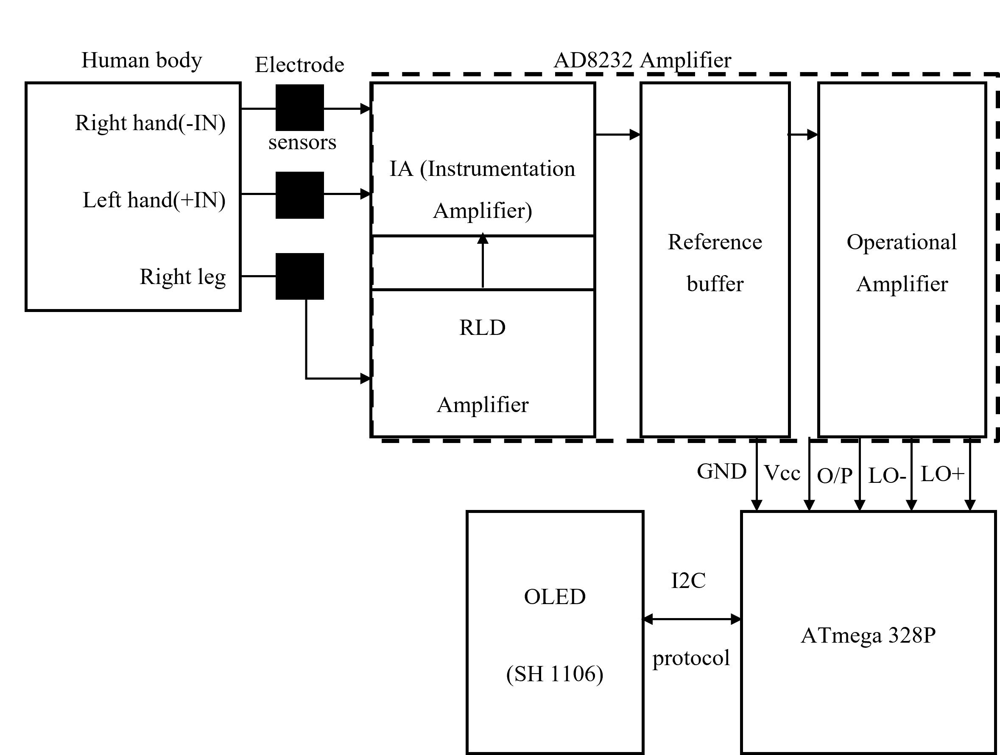
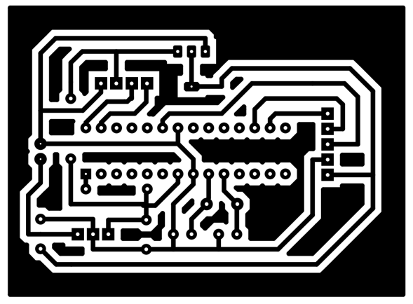
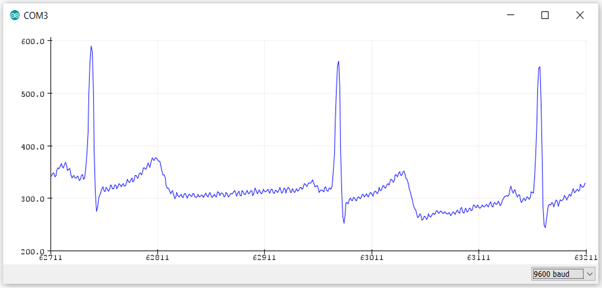
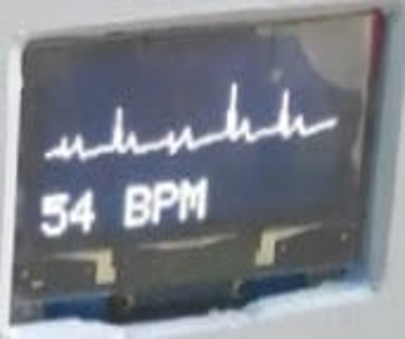

# Design and Implementation of a Portable ECG Device

A low‑cost, single‑lead ECG acquisition and display system built on an ATmega328P (Arduino Nano/Uno) and a 1.3″ SH1106 OLED. 

Real‑time waveform plotting (Lead I) plus Big‑Box BPM calculation. 

Published in peer-reviewed Journal of Innovations in Engineering Education (https://www.nepjol.info/index.php/jiee/article/view/34336)


---

## 🔎 Overview

This project:

- Captures a single‐lead ECG (Lead I: left arm → right arm) using an **AD8232** front‑end.  
- Samples and digitizes the signal on an **ATmega328P** (Arduino Nano/Uno).  
- Plots a continuous ECG trace in the top 48 pixels of a **128×64 SH1106 OLED**.  
- Computes heart rate (BPM) using the “Big‑Box” R‑R interval method and displays it in the bottom 16 pixels.  
- Demonstrates hands‑on experience with **I²C** via `Wire.h` and `Adafruit_SH1106`.

---

## ✨ Key Features

- **Lead I ECG** acquisition (Ag/AgCl electrodes)  
- **Real‑time** waveform scrolling  
- **Big‑Box BPM** calculation & large‑font display  
- **I²C‑driven OLED** (0x3C address)  
- Simple threshold‑based R‑peak detection with refractory period  
- Fully open‑source Arduino sketch

---

## 📁 Repository Layout
```
├── ecg_display_sh1106.ino # Main Arduino sketch
├── images/
│ ├── system_diagram.png # Overall system
│ ├── pcb_layout.png # PCB Layout Diagram
│ ├── ecg_results.png # Sample ECG screenshot
│ └── live_demo.png # Photo of live demo setup
└── README.md # ← You are here
```


---

## ⚙️ Hardware & Wiring

| Component        | Connection                       |
|------------------|----------------------------------|
| **AD8232**       | OUT → A0<br>3.3 V → 3.3 V<br>GND → GND |
| **Electrodes**   | LA (+), RA (–), RL (GND)         |
| **SH1106 OLED**  | VCC → 5 V<br>GND → GND<br>SDA → A4<br>SCL → A5 |
| **Power**        | 5 V battery pack or USB          |

> **I²C Note:**  
> The OLED is driven via the **Wire.h** library at address `0x3C`, showcasing practical I²C proficiency.

---

## 🛠 Software Dependencies

- **Arduino IDE** (v1.8.0 or later)  
- **Wire** (built‑in)  
- **Adafruit GFX** (via Library Manager)  
- **Adafruit SH1106** (community fork; install from GitHub)

---

## 🔗 Design & Schematic

### System Diagram


### PCB Layout  


---

## 🎬 Sample Results

### Real‑Time ECG Trace & BPM  


### Live Demonstration  


---

## 👤 Author & Contact
Santosh Adhikari

Email: santadh2015@gmail.com

GitHub: @santosh519

Thank you for reviewing! Feedback and contributions are welcome.
